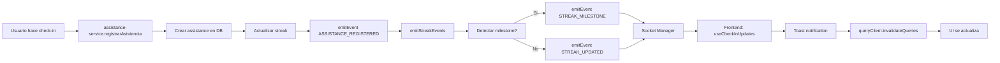

# WebSocket Real-Time Updates: Reviews y Check-ins

## Resumen

Se implementó funcionalidad WebSocket en tiempo real para:
1. **Reviews**: Notificaciones instantáneas cuando se crean o actualizan reseñas
2. **Check-ins**: Actualizaciones automáticas de asistencias y rachas (streaks)
3. **Ratings**: Actualización en tiempo real de ratings promedio de gimnasios

---

## Arquitectura

### Backend (Node.js)

#### 1. Event Emitter (`backend/node/websocket/events/event-emitter.js`)

Eventos definidos:
```javascript
EVENTS = {
  // Reviews
  REVIEW_CREATED: 'review:created',
  REVIEW_UPDATED: 'review:updated',
  GYM_RATING_UPDATED: 'gym:rating:updated',

  // Assistance & Streaks
  ASSISTANCE_REGISTERED: 'assistance:registered',
  STREAK_UPDATED: 'streak:updated',
  STREAK_MILESTONE: 'streak:milestone',
}
```

#### 2. Review Service (`backend/node/services/review-service.js`)

Emite eventos después de:
- **Crear review** (líneas 276-293):
  ```javascript
  emitEvent(EVENTS.REVIEW_CREATED, {
    reviewId: review.id_review,
    gymId: command.gymId,
    userId: command.userId,
    rating: review.rating,
    title: review.title,
    comment: review.comment,
  });
  ```

- **Actualizar review** (líneas 359-376):
  ```javascript
  emitEvent(EVENTS.REVIEW_UPDATED, {
    reviewId: command.reviewId,
    gymId: review.id_gym,
    userId: review.id_user_profile,
    rating: updated.rating,
    title: updated.title,
    comment: updated.comment,
  });
  ```

- **Actualizar rating del gym** (después de recalcular stats):
  ```javascript
  emitEvent(EVENTS.GYM_RATING_UPDATED, {
    gymId: command.gymId,
    averageRating: parseFloat(updatedStats.avg_rating),
    totalReviews: updatedStats.total_reviews,
  });
  ```

#### 3. Assistance Service (`backend/node/services/assistance-service.js`)

**Nueva función helper** (líneas 47-78):
```javascript
const emitStreakEvents = (userProfileId, oldStreak, newStreak) => {
  // Emite STREAK_UPDATED
  emitEvent(EVENTS.STREAK_UPDATED, {
    userProfileId,
    currentStreak: newStreak.value,
    longestStreak: Math.max(newStreak.value, newStreak.last_value || 0),
    timestamp: new Date().toISOString(),
  });

  // Detecta milestones (7, 14, 30, 50, 100, 200, 365 días)
  const milestone = milestones.find(m => newStreak.value >= m && oldStreak.value < m);

  if (milestone) {
    emitEvent(EVENTS.STREAK_MILESTONE, {
      userProfileId,
      milestone,
      currentStreak: newStreak.value,
      message: messages[milestone],
    });
  }
};
```

**Mensajes de milestone:**
- 7 días: "¡Primera semana completada! 🎉"
- 14 días: "¡Dos semanas seguidas! 💪"
- 30 días: "¡Un mes entero! ¡Increíble! 🔥"
- 50 días: "¡50 días consecutivos! ¡Imparable! ⭐"
- 100 días: "¡100 días! ¡Eres una leyenda! 👑"
- 200 días: "¡200 días! ¡Nivel maestro! 🏆"
- 365 días: "¡UN AÑO COMPLETO! ¡EXTRAORDINARIO! 🌟"

Emite eventos en:
- `registrarAsistencia()` (líneas 243-250)
- `autoCheckIn()` (líneas 455-462)
- `verificarAutoCheckIn()` (líneas 684-691)

#### 4. Socket Manager (`backend/node/websocket/socket-manager.js`)

Ya registra los event listeners para reviews (líneas 145-164):
```javascript
appEvents.on(EVENTS.REVIEW_CREATED, (data) => {
  if (data.gymId) {
    io.to(`gym:${data.gymId}`).emit('review:new', {
      reviewId: data.reviewId,
      gymId: data.gymId,
      rating: data.rating,
      timestamp: data.timestamp
    });
  }
});

appEvents.on(EVENTS.GYM_RATING_UPDATED, (data) => {
  if (data.gymId) {
    io.to(`gym:${data.gymId}`).emit('gym:rating:updated', {
      gymId: data.gymId,
      averageRating: data.averageRating,
      totalReviews: data.totalReviews
    });
  }
});
```

---

### Frontend (React Native)

#### 1. WebSocket Types (`src/shared/types/websocket.types.ts`)

Nuevos tipos agregados:
```typescript
export interface ReviewNewPayload {
  reviewId: number;
  gymId: number;
  userId: number;
  rating: number;
  title?: string;
  comment?: string;
  timestamp: string;
}

export interface ReviewUpdatedPayload {
  reviewId: number;
  gymId: number;
  userId: number;
  rating: number;
  title?: string;
  comment?: string;
  timestamp: string;
}

export interface GymRatingUpdatedPayload {
  gymId: number;
  averageRating: number;
  totalReviews: number;
  timestamp?: string;
}
```

Eventos:
```typescript
WS_EVENTS = {
  REVIEW_NEW: 'review:new',
  REVIEW_UPDATED: 'review:updated',
  GYM_RATING_UPDATED: 'gym:rating:updated',
}
```

#### 2. useReviewUpdates Hook (`src/shared/hooks/useReviewUpdates.ts`)

Hook personalizado para escuchar cambios de reviews:

```typescript
interface ReviewUpdatesCallbacks {
  onNewReview?: (data: ReviewNewPayload) => void;
  onReviewUpdated?: (data: ReviewUpdatedPayload) => void;
  onRatingUpdated?: (data: GymRatingUpdatedPayload) => void;
}

export function useReviewUpdates(
  gymId: number | null,
  callbacks: ReviewUpdatesCallbacks
) {
  // Escucha eventos:
  // - 'review:new'
  // - 'review:updated'
  // - 'gym:rating:updated'

  // Filtra por gymId para solo procesar eventos del gym actual
}
```

**Características:**
- Filtra eventos por `gymId` (solo procesa eventos del gym actual)
- Usa `useCallback` y refs para evitar recrear handlers
- Auto-cleanup al desmontar componente
- Registra eventos solo si el gymId es válido

#### 3. useCheckInUpdates Hook (`src/shared/hooks/useCheckInUpdates.ts`)

Hook para escuchar actualizaciones de check-ins y streaks:

```typescript
interface CheckInUpdatesCallbacks {
  onCheckIn?: (data: { userId: number; gymId: number }) => void;
  onStreakUpdated?: (data: { currentStreak: number; longestStreak: number }) => void;
  onStreakMilestone?: (data: { milestone: number; message: string }) => void;
}

export function useCheckInUpdates(callbacks: CheckInUpdatesCallbacks) {
  // Escucha eventos:
  // - 'assistance:new'
  // - 'streak:updated'
  // - 'streak:milestone'
}
```

#### 4. GymDetailScreenWrapper Integration

**Importaciones** (líneas 1-14):
```typescript
import { useEffect } from 'react';
import { useQueryClient } from '@tanstack/react-query';
import { useReviewUpdates, useCheckInUpdates } from '@shared/hooks';
import { websocketService } from '@shared/services/websocket.service';
import Toast from 'react-native-toast-message';
```

**Handlers de Reviews** (líneas 94-122):
```typescript
const handleNewReview = useCallback(() => {
  console.log('[GymDetailWrapper] New review received, invalidating queries...');
  queryClient.invalidateQueries({ queryKey: ['gym-reviews', gymId] });
  queryClient.invalidateQueries({ queryKey: ['gym-rating-stats', gymId] });
  queryClient.invalidateQueries({ queryKey: ['gym-detail', gymId] });
}, [queryClient, gymId]);

const handleReviewUpdated = useCallback(() => {
  console.log('[GymDetailWrapper] Review updated, invalidating queries...');
  queryClient.invalidateQueries({ queryKey: ['gym-reviews', gymId] });
  queryClient.invalidateQueries({ queryKey: ['gym-rating-stats', gymId] });
  queryClient.invalidateQueries({ queryKey: ['gym-detail', gymId] });
}, [queryClient, gymId]);

const handleRatingUpdated = useCallback((data) => {
  console.log('[GymDetailWrapper] Rating updated:', data);
  Toast.show({
    type: 'info',
    text1: 'Rating actualizado',
    text2: `${data.averageRating.toFixed(1)} ⭐ (${data.totalReviews} reseñas)`,
    position: 'bottom',
    visibilityTime: 2000,
  });
  queryClient.invalidateQueries({ queryKey: ['gym-detail', gymId] });
}, [queryClient, gymId]);
```

**Handlers de Check-ins** (líneas 127-163):
```typescript
const handleCheckInUpdate = useCallback((data) => {
  console.log('[GymDetailWrapper] New check-in:', data);
  queryClient.invalidateQueries({ queryKey: ['assistance'] });
  queryClient.invalidateQueries({ queryKey: ['streak'] });
}, [queryClient]);

const handleStreakUpdated = useCallback((data) => {
  console.log('[GymDetailWrapper] Streak updated:', data);
  Toast.show({
    type: 'success',
    text1: '🔥 Racha actualizada',
    text2: `${data.currentStreak} día${data.currentStreak !== 1 ? 's' : ''} consecutivo${data.currentStreak !== 1 ? 's' : ''}`,
    position: 'top',
    visibilityTime: 3000,
    topOffset: 60,
  });
  queryClient.invalidateQueries({ queryKey: ['streak'] });
}, [queryClient]);

const handleStreakMilestone = useCallback((data) => {
  console.log('[GymDetailWrapper] Streak milestone:', data);
  Toast.show({
    type: 'success',
    text1: '🎉 ¡Hito alcanzado!',
    text2: data.message,
    position: 'top',
    visibilityTime: 5000,
    topOffset: 60,
  });
}, []);
```

**Registrar listeners** (líneas 168-179):
```typescript
useReviewUpdates(gymId, {
  onNewReview: handleNewReview,
  onReviewUpdated: handleReviewUpdated,
  onRatingUpdated: handleRatingUpdated,
});

useCheckInUpdates({
  onCheckIn: handleCheckInUpdate,
  onStreakUpdated: handleStreakUpdated,
  onStreakMilestone: handleStreakMilestone,
});
```

**Join/Leave gym room** (líneas 184-194):
```typescript
useEffect(() => {
  if (gymId) {
    console.log('[GymDetailWrapper] Joining gym room:', gymId);
    websocketService.joinGym(gymId);

    return () => {
      console.log('[GymDetailWrapper] Leaving gym room:', gymId);
      websocketService.leaveGym(gymId);
    };
  }
}, [gymId]);
```

---

## Flujo de Datos

### Flujo de Reviews

```mermaid
graph LR
    A[Usuario crea review] --> B[review-service.createGymReview]
    B --> C[Guardar en DB]
    C --> D[Recalcular stats]
    D --> E[emitEvent REVIEW_CREATED]
    E --> F[Socket Manager]
    F --> G[io.to gym:gymId .emit review:new]
    G --> H[Frontend: useReviewUpdates]
    H --> I[queryClient.invalidateQueries]
    I --> J[UI se actualiza automáticamente]
```



### Flujo de Check-ins



---

## Estrategia de Actualización de UI

### React Query Cache Invalidation

En lugar de actualizar manualmente el estado, se usa `queryClient.invalidateQueries()`:

**Ventajas:**
- ✅ Refetch automático de datos
- ✅ UI siempre sincronizada con backend
- ✅ No hay estado duplicado
- ✅ Manejo automático de loading states

**Queries invalidadas:**

**Para reviews:**
```typescript
queryClient.invalidateQueries({ queryKey: ['gym-reviews', gymId] });
queryClient.invalidateQueries({ queryKey: ['gym-rating-stats', gymId] });
queryClient.invalidateQueries({ queryKey: ['gym-detail', gymId] });
```

**Para check-ins:**
```typescript
queryClient.invalidateQueries({ queryKey: ['assistance'] });
queryClient.invalidateQueries({ queryKey: ['streak'] });
```

### Toast Notifications

Se usan para dar feedback inmediato al usuario:

**Rating actualizado:**
```typescript
Toast.show({
  type: 'info',
  text1: 'Rating actualizado',
  text2: `${averageRating.toFixed(1)} ⭐ (${totalReviews} reseñas)`,
  position: 'bottom',
  visibilityTime: 2000,
});
```

**Streak actualizado:**
```typescript
Toast.show({
  type: 'success',
  text1: '🔥 Racha actualizada',
  text2: `${currentStreak} día${plural} consecutivo${plural}`,
  position: 'top',
  visibilityTime: 3000,
});
```

**Milestone alcanzado:**
```typescript
Toast.show({
  type: 'success',
  text1: '🎉 ¡Hito alcanzado!',
  text2: message, // "¡Primera semana completada! 🎉"
  position: 'top',
  visibilityTime: 5000,
});
```

---

## Rooms de WebSocket

### ¿Qué son los rooms?

Los "rooms" permiten agrupar conexiones de usuarios para enviar eventos solo a usuarios específicos:

```javascript
// Backend: Emitir a todos en la sala del gym
io.to(`gym:${gymId}`).emit('review:new', data);

// Frontend: Unirse a la sala
websocketService.joinGym(gymId);
```

### Rooms utilizados

**1. User room** (`user:${userProfileId}`):
- Notificaciones personales
- Streak updates del usuario
- Milestones del usuario

**2. Gym room** (`gym:${gymId}`):
- Reviews del gym
- Rating updates del gym
- Check-ins en el gym
- Presencia en el gym

### Join/Leave Automático

En `GymDetailScreenWrapper`, el usuario se une automáticamente al room del gym:

```typescript
useEffect(() => {
  if (gymId) {
    websocketService.joinGym(gymId);
    return () => websocketService.leaveGym(gymId);
  }
}, [gymId]);
```

**Esto asegura:**
- ✅ Recibir updates solo del gym que se está viendo
- ✅ No recibir spam de otros gyms
- ✅ Cleanup automático al salir de la pantalla

---

## Testing

### 1. Test de Reviews

**Pasos:**
1. Abrir pantalla de detalle de un gym en dispositivo A
2. Crear una review desde dispositivo B (o Postman)
3. **Resultado esperado:**
   - Dispositivo A recibe toast "Rating actualizado"
   - La lista de reviews se actualiza automáticamente
   - El rating promedio se actualiza en el header

### 2. Test de Check-in

**Pasos:**
1. Abrir pantalla de detalle de un gym en dispositivo A
2. Hacer check-in desde dispositivo B (o API)
3. **Resultado esperado:**
   - Dispositivo A recibe toast "🔥 Racha actualizada"
   - El contador de streak se actualiza
   - Si es milestone, muestra toast de celebración

### 3. Test de Milestone

**Pasos:**
1. Configurar usuario con streak de 6 días
2. Hacer check-in (alcanza 7 días)
3. **Resultado esperado:**
   - Toast: "🎉 ¡Hito alcanzado!"
   - Mensaje: "¡Primera semana completada! 🎉"
   - Visibilidad: 5 segundos en top

### 4. Logs de Debugging

**Backend:**
```
[EventEmitter] Event emitted: review:created
[ReviewHandler] Emitted review:new to gym:123
[EventEmitter] Event emitted: gym:rating:updated
[ReviewHandler] Emitted gym:rating-updated to gym:123 - 4.5 (12 reviews)
```

**Frontend:**
```
[GymDetailWrapper] Joining gym room: 123
[GymDetailWrapper] New review received, invalidating queries...
[GymDetailWrapper] Rating updated: { averageRating: 4.5, totalReviews: 12 }
[GymDetailWrapper] Leaving gym room: 123
```

---

## Archivos Modificados

### Backend
✅ `backend/node/services/review-service.js` - Agregados eventos WebSocket
✅ `backend/node/services/assistance-service.js` - Agregados eventos WebSocket y función `emitStreakEvents`
✅ `backend/node/websocket/handlers/review.handler.js` - Creado (aunque los eventos ya estaban en socket-manager)

### Frontend
✅ `frontend/gympoint-mobile/src/shared/types/websocket.types.ts` - Agregados tipos de reviews
✅ `frontend/gympoint-mobile/src/shared/hooks/useReviewUpdates.ts` - Creado
✅ `frontend/gympoint-mobile/src/shared/hooks/useCheckInUpdates.ts` - Creado
✅ `frontend/gympoint-mobile/src/shared/hooks/index.ts` - Exportados nuevos hooks
✅ `frontend/gympoint-mobile/src/features/gyms/presentation/ui/screens/GymDetailScreenWrapper.tsx` - Integrados hooks y join/leave gym

---

## Próximos Pasos Sugeridos

### 1. Agregar vibración en milestones
```typescript
import { Vibration } from 'react-native';

const handleStreakMilestone = useCallback((data) => {
  Vibration.vibrate([0, 100, 50, 100]); // Patrón de vibración
  Toast.show({ /* ... */ });
}, []);
```

### 2. Animación de confetti en milestones importantes
Para milestones grandes (30, 100, 365 días), agregar animación de celebración.

### 3. Notificación push cuando otro usuario hace review
Si el gym owner está conectado, notificarle cuando recibe una nueva review.

### 4. Histórico de milestones
Guardar en DB cuando se alcanza un milestone y mostrar historial en perfil.

### 5. Badge de "review reciente" en lista de gyms
Mostrar indicador visual si el gym recibió una review en las últimas 24h.

---

## Consideraciones de Performance

### 1. Filtrado por gymId
Los hooks filtran eventos por `gymId` para evitar procesamiento innecesario:
```typescript
if (data.gymId !== gymId) return;
```

### 2. Memoización de callbacks
Todos los handlers usan `useCallback` para evitar recrear funciones:
```typescript
const handleNewReview = useCallback(() => {
  // ...
}, [queryClient, gymId]);
```

### 3. Refs para callbacks
Los hooks usan refs para evitar dependencias en useEffect:
```typescript
const onNewReviewRef = useRef(onNewReview);
useEffect(() => {
  onNewReviewRef.current = onNewReview;
}, [onNewReview]);
```

### 4. Invalidación selectiva de queries
Solo se invalidan las queries necesarias, no todas las queries de la app.

### 5. Rooms específicos
Emitir solo a rooms relevantes (`gym:${gymId}`, `user:${userId}`) evita enviar datos a todos los usuarios conectados.

---

## Troubleshooting

### Problema: No recibo eventos de review

**Verificar:**
1. ¿El usuario está conectado a WebSocket?
   ```typescript
   console.log('Connected:', websocketService.isConnected());
   ```

2. ¿Se unió al room del gym?
   ```typescript
   console.log('[GymDetailWrapper] Joining gym room:', gymId);
   ```

3. ¿El backend está emitiendo el evento?
   ```
   [EventEmitter] Event emitted: review:created
   ```

4. ¿El gymId coincide?
   - Frontend filtra por `data.gymId !== gymId`

### Problema: Toast no se muestra

**Verificar:**
1. ¿Toast está configurado en App.tsx?
   ```typescript
   <Toast />
   ```

2. ¿La función callback está registrada?
   ```typescript
   useReviewUpdates(gymId, {
     onRatingUpdated: handleRatingUpdated, // ✅ Debe estar presente
   });
   ```

### Problema: UI no se actualiza

**Verificar:**
1. ¿Se está invalidando la query correcta?
   ```typescript
   queryClient.invalidateQueries({ queryKey: ['gym-reviews', gymId] });
   ```

2. ¿El query está configurado en el componente?
   ```typescript
   const { data } = useQuery({ queryKey: ['gym-reviews', gymId] });
   ```

3. ¿El refetch está habilitado?
   - Por defecto React Query refetchea al invalidar

---

## Resumen Final

✅ **Reviews en tiempo real**: Cuando alguien crea o actualiza una review, todos los usuarios viendo ese gym reciben la actualización instantáneamente.

✅ **Check-ins en tiempo real**: Cuando un usuario hace check-in, su streak se actualiza y recibe notificaciones de milestones.

✅ **Ratings actualizados**: El rating promedio del gym se actualiza automáticamente cuando se agregan reviews.

✅ **Toast notifications**: Feedback visual inmediato para el usuario.

✅ **Cache invalidation**: La UI se sincroniza automáticamente con el backend mediante React Query.

✅ **Performance optimizado**: Filtrado por gymId, memoización, y uso de rooms para evitar procesamiento innecesario.

🚀 **La app ahora tiene capacidades de tiempo real completas para reviews y check-ins!**
